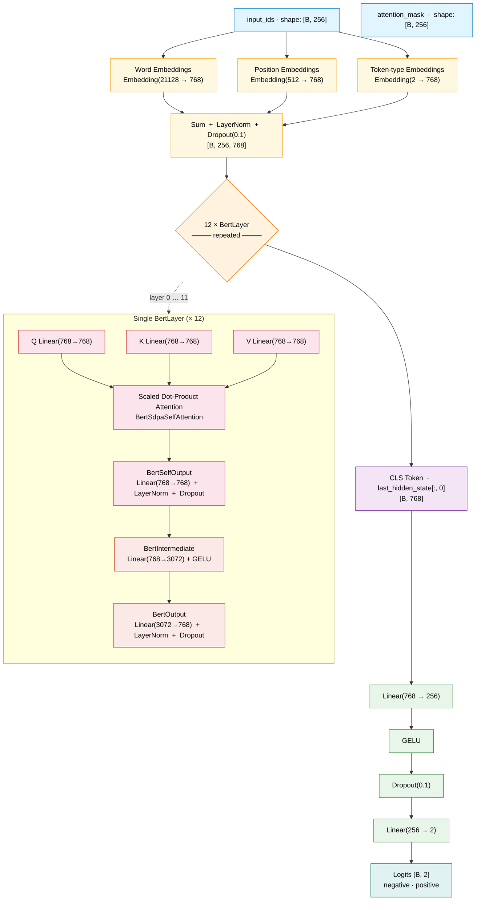

# BERT Classifier Architecture

This document distinguishes between:

- the raw pretrained Hugging Face backbone loaded as `BertModel`
- your final instantiated model, which wraps that backbone with `CLS` pooling and a 2-layer MLP sentiment-classification head

## Overview

- Backbone repo: `hfl/chinese-roberta-wwm-ext`
- Raw pretrained model class: `BertModel`
- Task: binary sentiment classification
- Inputs: `input_ids`, `attention_mask` (max_length = 256)
- Outputs: 2-class logits for `negative` and `positive`
- Total parameters: **102,465,026** (all trainable)

## PyTorch Model Print

Instantiated via `bert_classifier.toml` (`classifier_hidden_dim=256`, `dropout=0.1`, `pooling=cls`):

```text
BertClassifier(
  (encoder): BertModel(
    (embeddings): BertEmbeddings(
      (word_embeddings): Embedding(21128, 768, padding_idx=0)
      (position_embeddings): Embedding(512, 768)
      (token_type_embeddings): Embedding(2, 768)
      (LayerNorm): LayerNorm((768,), eps=1e-12, elementwise_affine=True)
      (dropout): Dropout(p=0.1, inplace=False)
    )
    (encoder): BertEncoder(
      (layer): ModuleList(
        (0-11): 12 x BertLayer(
          (attention): BertAttention(
            (self): BertSdpaSelfAttention(
              (query): Linear(in_features=768, out_features=768, bias=True)
              (key): Linear(in_features=768, out_features=768, bias=True)
              (value): Linear(in_features=768, out_features=768, bias=True)
              (dropout): Dropout(p=0.1, inplace=False)
            )
            (output): BertSelfOutput(
              (dense): Linear(in_features=768, out_features=768, bias=True)
              (LayerNorm): LayerNorm((768,), eps=1e-12, elementwise_affine=True)
              (dropout): Dropout(p=0.1, inplace=False)
            )
          )
          (intermediate): BertIntermediate(
            (dense): Linear(in_features=768, out_features=3072, bias=True)
            (intermediate_act_fn): GELUActivation()
          )
          (output): BertOutput(
            (dense): Linear(in_features=3072, out_features=768, bias=True)
            (LayerNorm): LayerNorm((768,), eps=1e-12, elementwise_affine=True)
            (dropout): Dropout(p=0.1, inplace=False)
          )
        )
      )
    )
    (pooler): BertPooler(
      (dense): Linear(in_features=768, out_features=768, bias=True)
      (activation): Tanh()
    )
  )
  (projection): Sequential(
    (0): Linear(in_features=768, out_features=256, bias=True)
    (1): GELU(approximate='none')
    (2): Dropout(p=0.1, inplace=False)
  )
  (classifier): Linear(in_features=256, out_features=2, bias=True)
)

Total params    : 102,465,026
Trainable params: 102,465,026
```

## Mermaid Flowchart



## Raw Pretrained BertModel

The raw checkpoint is loaded with:

```python
from transformers import AutoModel
model = AutoModel.from_pretrained("hfl/chinese-roberta-wwm-ext")
```

Its top-level PyTorch modules are:

```text
BertModel
├── embeddings: BertEmbeddings
├── encoder: BertEncoder
└── pooler: BertPooler
```

The last encoder block is `encoder.layer[11]`, and the final parameter group in the raw backbone is:

```text
pooler.dense.weight
pooler.dense.bias
```

## Connection To Your Implementation

- Your custom class is defined in `models/bert_classifier.py`.
- It loads the raw pretrained backbone with `AutoModel.from_pretrained(...)`.
- It does not use the pretrained MLM head from the original published checkpoint.
- It also does not use `pooler_output` in the current implementation.
- Instead, it takes `outputs.last_hidden_state[:, 0]` and applies your own MLP classifier head.

## Wrapped Model

- Pooling: `CLS`
- Wrapped head: `Linear(768, 256) -> GELU -> Dropout -> Linear(256, 2)`
- Config: `configs/bert_classifier.toml`

## Code Mapping

- Backbone wrapper: `models/bert_classifier.py`
- Model factory: `models/__init__.py`
- Config: `configs/bert_classifier.toml`
