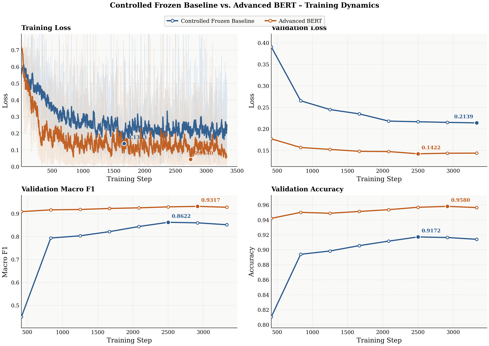
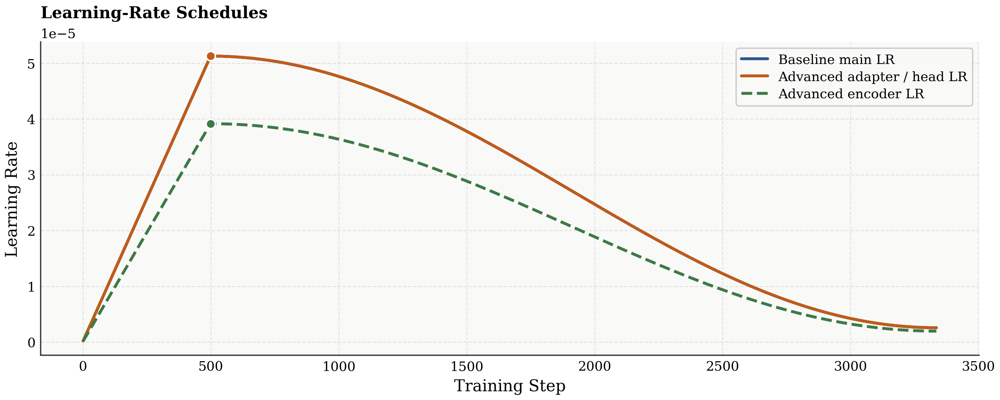

# Project 1 Report: Text Classification with Deep Learning

## 1. Introduction

This project studies binary sentiment classification on a Chinese review dataset. The
goal is to compare two substantially different neural architectures for the basic task,
and then improve one of them through a more advanced design.

For the basic task, I implemented:

1. A character-level bidirectional LSTM classifier.
2. A pretrained Transformer classifier based on `hfl/chinese-roberta-wwm-ext`.

For the advanced task, I chose the BERT-based model and replaced the simple pooled
classification head with a more expressive architecture built around multi-view pooling,
layer mixing, and parameter-efficient adaptation. All reported numbers in this report
come from actual saved checkpoints in the project directory rather than manual estimates.

The three final checkpoints used in this report are:

- [lstm_classifier/best_model.pt](/home/richard/projects/cs290s-dl-practice/projects/project1-text-classification/checkpoints/lstm_classifier/best_model.pt)
- [bert_classifier/best_model.pt](/home/richard/projects/cs290s-dl-practice/projects/project1-text-classification/checkpoints/bert_classifier/best_model.pt)
- [bert_classifier_advanced/best_model.pt](/home/richard/projects/cs290s-dl-practice/projects/project1-text-classification/checkpoints/bert_classifier_advanced/best_model.pt)

## 2. Dataset and Preprocessing

### 2.1 Dataset summary

The dataset is provided as CSV files with the text column `review` and the label column
`label`. The training and validation splits are:

| Split | Samples | Positive | Negative | Positive Ratio | Avg. Characters | Min Characters | Max Characters |
| --- | ---: | ---: | ---: | ---: | ---: | ---: | ---: |
| Train | 10,000 | 8,066 | 1,934 | 80.66% | 53.29 | 8 | 1,797 |
| Validation | 2,500 | 2,025 | 475 | 81.00% | 54.69 | 11 | 1,788 |

Two observations are important:

- The dataset is moderately imbalanced toward the positive class.
- Reviews are usually short on average, but a small number of examples are very long.

Because of the class imbalance, macro F1 is more informative than accuracy alone. A
model that predicts the majority class well can still have weak minority-class behavior,
so this report treats macro F1 as the main model-selection metric.

### 2.2 Preprocessing pipeline

The preprocessing logic is implemented in [data.py](/home/richard/projects/cs290s-dl-practice/projects/project1-text-classification/data.py).

#### Character-level preprocessing for the BiLSTM

- The LSTM model uses character-level encoding.
- A vocabulary is built from the training set only.
- `min_frequency=2` is used, so rare characters are mapped to `<unk>`.
- Sequences are truncated or padded to `max_length=512`.
- The resulting character vocabulary size is `3,027`, including special tokens.

This design is simple and robust, but it cannot exploit external pretrained semantic
knowledge.

#### Transformer preprocessing for the BERT models

- Both BERT variants use `hfl/chinese-roberta-wwm-ext`.
- Tokenization is handled by the Hugging Face tokenizer.
- Inputs are truncated or padded to `max_length=256`.
- The tokenizer vocabulary size is `21,128`.

Compared with the character-level pipeline, the transformer pipeline uses subword
tokenization and leverages a strong pretrained encoder, which is expected to help
generalization and contextual understanding.

## 3. Model Architectures

### 3.1 Basic model 1: Character-level BiLSTM

The first model is implemented in [lstm_classifier.py](/home/richard/projects/cs290s-dl-practice/projects/project1-text-classification/models/lstm_classifier.py).

Its structure is:

1. Character embedding layer with `embedding_dim=64`.
2. One-layer bidirectional LSTM with hidden size `64`.
3. Concatenation of the final forward and backward hidden states.
4. Dropout with probability `0.3`.
5. Linear classifier for binary prediction.

This is a standard sequence model baseline. It processes raw character sequences and
learns contextual features through recurrent recurrence, but its representational
capacity is limited compared with a pretrained Transformer.

Actual parameter count:

- Total parameters: `260,546`
- Trainable parameters: `260,546`

### 3.2 Basic model 2: Baseline BERT classifier

The second model is implemented in [bert_classifier.py](/home/richard/projects/cs290s-dl-practice/projects/project1-text-classification/models/bert_classifier.py).

Its structure is:

1. Pretrained encoder: `hfl/chinese-roberta-wwm-ext`
2. Masked mean pooling over token embeddings
3. Projection MLP:
   - linear layer from hidden size to `classifier_hidden_dim=256`
   - GELU activation
   - dropout `0.1`
4. Final linear classifier

This baseline keeps the classifier head simple. It treats the encoder output as a single
pooled sentence representation and relies on mean pooling to summarize token-level
features.

Actual parameter count:

- Total parameters: `102,465,026`
- Trainable parameters: `102,465,026`

### 3.3 Advanced model: Optimized BERT classifier

The advanced model is implemented in [bert_classifier_advanced.py](/home/richard/projects/cs290s-dl-practice/projects/project1-text-classification/models/bert_classifier_advanced.py).

The modified architecture includes several interpretable changes:

1. **Top-layer mixing**
   - Instead of using only the final encoder layer, the model learns a weighted mixture
     of the top 4 hidden layers.
   - This allows the classifier to combine different levels of abstraction from the
     pretrained encoder.

2. **Multi-view pooling**
   - The sentence representation includes:
     - `CLS` token features
     - masked mean pooling
     - learned attention pooling
     - masked max pooling
   - These views capture complementary information. Mean pooling is stable, attention
     pooling focuses on task-relevant tokens, and max pooling is useful when a few
     highly polarized tokens dominate sentiment.

3. **Gated pooling fusion**
   - A learned gate decides how much weight to assign to each pooled representation.
   - The gated summary is concatenated with the original pooled views and normalized
     before classification.

4. **Parameter-efficient adaptation**
   - LoRA adapters are injected into query, key, and value projections of all 12
     transformer layers.
   - Additional LoRA adapters are inserted into the attention output projection of the
     top 4 layers.
   - BitFit is enabled, so encoder bias parameters remain trainable.
   - LayerNorm tuning is disabled in the final winning configuration.

5. **Wider classification head**
   - The fused feature vector is projected to `classifier_hidden_dim=512`, followed by
     GELU and dropout `0.08`.

Actual parameter count:

- Total parameters: `105,730,571`
- Trainable parameters: `3,565,835`

This is an important result. Although the full model has slightly more total parameters
than the baseline BERT, only about 3.57 million parameters are trainable. Most of the
pretrained backbone remains frozen, which makes the improvement more computationally
efficient than full-model fine-tuning.

### 3.4 Controlled baseline vs. advanced BERT

For the advanced-task comparison, I used a controlled baseline that keeps the same
backbone, optimizer schedule, classifier hidden size, dropout, batch size, number of
epochs, warmup ratio, and validation cadence as the advanced model, but freezes the
pretrained encoder and trains only a `CLS`-based classification head. This makes the
comparison much cleaner.

The main differences are summarized below.

| Component | Controlled frozen baseline | Advanced BERT |
| --- | --- | --- |
| Encoder usage | Pretrained encoder frozen | Learned mix of top 4 layers |
| Pooling | `CLS` token only | `CLS` + mean + attention + max + gated fusion |
| Adaptation | No encoder adaptation | LoRA + BitFit, backbone mostly frozen |
| Classifier head | 512-dim MLP on `CLS` | 512-dim MLP on fused multi-view features |
| Trainable parameters | 394,754 | 3,565,835 |

## 4. Training Setup

### 4.1 Shared implementation details

All models were trained in the Project 1 pipeline through [train.py](/home/richard/projects/cs290s-dl-practice/projects/project1-text-classification/train.py).
The implementation uses:

- PyTorch
- AdamW optimizer
- checkpointing based on validation macro F1
- TensorBoard logging under `runs/`
- fixed random seed `42`

The best checkpoint for each experiment is saved to `checkpoints/<experiment_name>/best_model.pt`.

### 4.2 Exact experiment settings

#### BiLSTM configuration

From [lstm_classifier.toml](/home/richard/projects/cs290s-dl-practice/projects/project1-text-classification/configs/lstm_classifier.toml):

- Encoding: character-level
- Max sequence length: `512`
- Minimum character frequency: `2`
- Batch size: `64`
- Learning rate: `1e-3`
- Weight decay: `0.05`
- Epochs: `15`
- Validation interval: `200` steps

#### Controlled frozen baseline configuration

From [bert_classifier.toml](/home/richard/projects/cs290s-dl-practice/projects/project1-text-classification/configs/bert_classifier.toml):

- Backbone: `hfl/chinese-roberta-wwm-ext`
- Max sequence length: `256`
- Classifier hidden dimension: `512`
- Dropout: `0.08`
- Encoder frozen: `true`
- Pooling strategy: `cls`
- Batch size: `12`
- Head learning rate: `5.1261745611921186e-05`
- Encoder learning rate field: `3.9139370975328926e-05` (inactive because encoder parameters are frozen)
- Weight decay: `0.0016864974751216414`
- Epochs: `4`
- Warmup ratio: `0.1499362438641551`
- Final LR scale: `0.05`
- Validation interval: `417` steps

#### Advanced BERT configuration

From [bert_classifier_advanced.toml](/home/richard/projects/cs290s-dl-practice/projects/project1-text-classification/configs/bert_classifier_advanced.toml):

- Backbone: `hfl/chinese-roberta-wwm-ext`
- Max sequence length: `256`
- Classifier hidden dimension: `512`
- Dropout: `0.08`
- Layer mix depth: `4`
- BitFit: `true`
- LayerNorm tuning: `false`
- LoRA rank: `24`
- LoRA alpha: `32.0`
- LoRA dropout: `0.0`
- LoRA target layers: `12`
- LoRA output target layers: `4`
- Batch size: `12`
- Head/adapter learning rate: `5.1261745611921186e-05`
- Encoder learning rate: `3.9139370975328926e-05`
- Weight decay: `0.0016864974751216414`
- Epochs: `4`
- Warmup ratio: `0.1499362438641551`
- Final LR scale: `0.05`
- Validation interval: `417` steps

### 4.3 Controlled comparison protocol

For the final advanced-task comparison, I reran a matched baseline in the Project 1
pipeline with the same backbone, hidden size, dropout, batch size, learning-rate
schedule, weight decay, epoch count, validation interval, and random seed as the
advanced model. The only intentional differences were architectural:

- the matched baseline freezes the pretrained encoder and uses only the `CLS` token,
- the advanced model adds layer mixing, multi-view pooling, gated fusion, and
  parameter-efficient encoder adaptation through LoRA and BitFit.

This protocol does not isolate every single advanced component individually, but it does
isolate the effect of moving from a simple frozen-head BERT classifier to the richer
advanced architecture under the same optimization scaffold.

## 5. Results

All metrics below are taken directly from the saved `best_model.pt` checkpoint for each
experiment.

### 5.1 Main validation results

| Model | Accuracy | Precision | Recall | F1 | Macro F1 | Validation Loss |
| --- | ---: | ---: | ---: | ---: | ---: | ---: |
| BiLSTM | 0.9252 | 0.9505 | 0.9575 | 0.9540 | 0.8770 | 0.2596 |
| Controlled frozen BERT baseline | 0.9172 | 0.9426 | 0.9560 | 0.9493 | 0.8622 | 0.2166 |
| Advanced BERT | 0.9580 | 0.9738 | 0.9743 | 0.9741 | 0.9317 | 0.1435 |

### 5.2 Improvement over the controlled frozen baseline

Under matched optimization settings, the advanced BERT improves over the controlled
frozen baseline by:

- Accuracy: `+0.0408`
- Precision: `+0.0313`
- Recall: `+0.0183`
- F1: `+0.0248`
- Macro F1: `+0.0695`
- Validation loss: `-0.0731`

### 5.3 Interpretation of the table

Three conclusions follow directly from the results:

1. The Transformer models strongly outperform the BiLSTM baseline.
2. Under a controlled comparison, the advanced architecture is much stronger than a
   frozen `CLS`-head baseline built on the same pretrained backbone.
3. The large drop in validation loss from `0.2166` to `0.1435` supports the claim that
   the gain is not a trivial metric fluctuation.

### 5.4 TensorBoard figures

The following figures were exported directly from the TensorBoard event files of the
controlled baseline run and the reproduced advanced run. They therefore reflect the
actual training dynamics rather than manually reconstructed summaries.



*Figure 1. TensorBoard comparison of training loss, validation loss, validation macro
F1, and validation accuracy. The advanced model stays below the controlled baseline on
validation loss throughout training and reaches a clearly higher validation macro F1.
The controlled baseline peaks around step `2502`, while the advanced model continues to
improve to its best checkpoint at step `2919`.*



*Figure 2. Logged learning-rate schedules. Both experiments use the same warmup-plus-
decay structure, but the advanced model splits optimization into a higher adapter/head
learning rate and a lower encoder learning rate, which is consistent with its
parameter-efficient adaptation design.*

### 5.5 Experiment artifacts

TensorBoard logs for the reported runs are stored in `runs/`. The most important BERT
artifacts are:

- Controlled frozen baseline run:
  [bert_classifier_20260331-220647](/home/richard/projects/cs290s-dl-practice/projects/project1-text-classification/runs/bert_classifier/bert_classifier_20260331-220647)
- Controlled frozen baseline training log:
  [bert_classifier.log](/home/richard/projects/cs290s-dl-practice/projects/project1-text-classification/bert_classifier.log)
- Advanced BERT reproduced run:
  [bert_classifier_advanced_20260331-025421](/home/richard/projects/cs290s-dl-practice/projects/project1-text-classification/runs/bert_classifier_advanced/bert_classifier_advanced_20260331-025421)
- Advanced BERT training log:
  [advanced_trial12.log](/home/richard/projects/cs290s-dl-practice/projects/project1-text-classification/advanced_trial12.log)
- Figure export script:
[export_report_figures.py](/home/richard/projects/cs290s-dl-practice/projects/project1-text-classification/scripts/export_report_figures.py)

These logs can be visualized with:

```bash
cd /home/richard/projects/cs290s-dl-practice/projects/project1-text-classification
tensorboard --logdir ./runs
```

For the controlled baseline, the best checkpoint was saved at step `2502` with
`macro_f1=0.8622` in
[bert_classifier_20260331-220647](/home/richard/projects/cs290s-dl-practice/projects/project1-text-classification/runs/bert_classifier/bert_classifier_20260331-220647).

For the advanced run, the best mid-epoch checkpoint was saved at step `2919` with
`macro_f1=0.9317`.

## 6. Comparative Analysis and Discussion

### 6.1 Comparison of the two basic models

The BiLSTM satisfies the project expectation and reaches validation accuracy above
`0.92`. However, it is weaker than the controlled BERT baseline on loss and remains well
below the advanced model on macro F1. This result is consistent with the design of the
models.

The BiLSTM must learn sentiment representations from the supervised training data alone.
Although the bidirectional recurrent structure captures local and medium-range context,
it does not benefit from large-scale language pretraining. It is therefore less able to
resolve ambiguous phrases, long-distance dependencies, and domain-specific sentiment
patterns than the pretrained BERT encoder.

Even the controlled frozen BERT baseline is built on pretrained contextualized
representations, and the advanced model shows how much additional performance can be
unlocked by improving feature aggregation and lightweight adaptation on top of that
backbone.

### 6.2 Why the advanced BERT works better than the controlled baseline

The controlled comparison produces a strong and easy-to-explain result. When the
backbone, hidden size, dropout, batch size, and learning-rate schedule are matched, the
advanced model improves macro F1 from `0.8622` to `0.9317`, a gain of about `0.0695`.
That is much larger than ordinary run-to-run noise and supports the claim that the
architectural changes matter.

The improvement is explainable through the architecture:

- **Layer mixing** allows the classifier to use complementary semantic information from
  several high-level encoder layers instead of trusting only the final layer.
- **Multi-view pooling** reduces the risk that a single summary statistic hides useful
  sentiment cues. Some examples are better described by a global average, while others
  depend on a few highly polar words that max pooling or attention pooling can capture.
- **Gated fusion** lets the model adaptively weight these views per example instead of
  using a fixed pooling rule.
- **LoRA and BitFit** provide targeted adaptation capacity while keeping most of the
  pretrained encoder frozen. This reduces the optimization burden compared with full
  fine-tuning and makes the model parameter-efficient.

An especially important empirical detail is that the advanced model achieved the same
kind of advantage in the actual Project 1 training pipeline, not only in the
`autoresearch` sandbox. The reproduced Project 1 checkpoint reached:

- `macro_f1=0.9317188460406945`
- `accuracy=0.9580`
- `val_loss=0.14350296260118484`

This makes the optimization story much stronger, because the improvement survives
migration from the experimental search harness into the real project codebase and remains
visible under a matched-baseline protocol.

### 6.3 Strengths and weaknesses of the final system

#### Strengths

- Best validation metrics among all implemented models.
- Much lower validation loss than the controlled frozen baseline.
- Only `3.57M` trainable parameters despite using a large pretrained backbone.
- Uses interpretable architectural ideas rather than an arbitrary increase in hidden
  dimension alone.

#### Weaknesses

- The advanced model still combines several changes at once, so the contribution of each
  individual component is not fully disentangled.
- The dataset is class-imbalanced, so even strong accuracy numbers should be interpreted
  together with macro F1.
- The advanced model is more complex than the baseline and therefore harder to explain,
  reproduce, and debug.

### 6.4 What this project shows

The basic-task comparison demonstrates that pretrained Transformer representations are
substantially stronger than a lightweight recurrent baseline on this dataset. The
advanced-task comparison shows that BERT performance can still be improved through a more
careful sentence representation design and parameter-efficient adaptation strategy.

The key lesson is not simply that "larger models are better." The final result suggests
that **how** encoder features are aggregated and **where** the model is allowed to adapt
inside the pretrained network both matter.

## 7. Conclusion and Future Work

This project implemented and evaluated three sentiment classifiers:

1. A character-level BiLSTM.
2. A controlled frozen BERT baseline with a `CLS`-only classification head.
3. An advanced BERT classifier with layer mixing, gated multi-view pooling, and LoRA-
   based parameter-efficient adaptation.

The main empirical conclusions are:

- The BiLSTM is a valid baseline and exceeds the minimum expected performance threshold.
- Under a controlled matched-baseline experiment, the advanced BERT improves from
  `macro_f1=0.8622` to `0.9317`, reaching the best overall performance with
  `accuracy=0.9580`.

Future work should focus on finer-grained ablations and broader evaluation:

1. Separate the effects of layer mixing, gated pooling, LoRA, and BitFit with one-factor
   ablations.
2. Evaluate robustness across multiple random seeds to measure variance.
3. Add class-balanced losses or sampling strategies to study minority-class behavior.
4. Explore lighter-weight adapter settings to reduce training cost further without losing
   performance.

Overall, the project shows that the optimization strategy works: the advanced system
produces a measurable and reproducible improvement over a controlled frozen-baseline BERT
classifier in the actual Project 1 pipeline.

## 8. References

1. Hochreiter, S., & Schmidhuber, J. (1997). Long short-term memory. *Neural
   Computation*, 9(8), 1735-1780.
2. Devlin, J., Chang, M.-W., Lee, K., & Toutanova, K. (2019). BERT: Pre-training of
   deep bidirectional transformers for language understanding. *NAACL-HLT 2019*.
3. Hu, E. J., Shen, Y., Wallis, P., Allen-Zhu, Z., Li, Y., Wang, S., Wang, L., & Chen,
   W. (2022). LoRA: Low-rank adaptation of large language models. *ICLR 2022*.
4. Liu, Y., Ott, M., Goyal, N., Du, J., Joshi, M., Chen, D., Levy, O., Lewis, M.,
   Zettlemoyer, L., & Stoyanov, V. (2019). RoBERTa: A robustly optimized BERT pretraining
   approach. arXiv:1907.11692.
