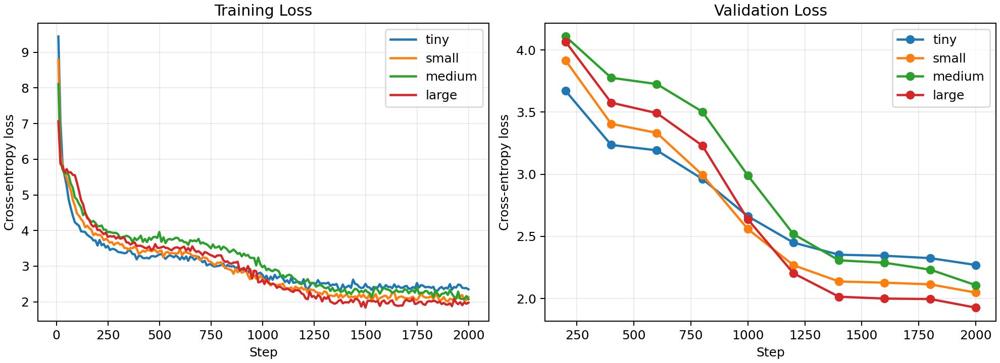
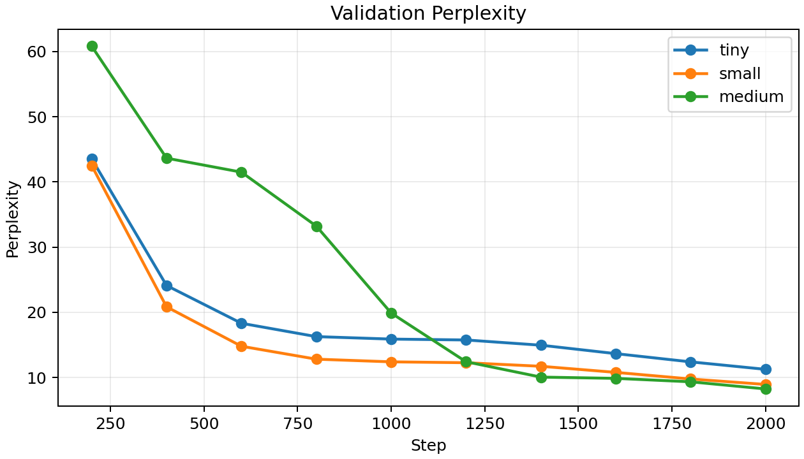
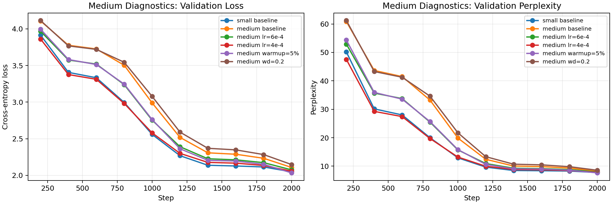

# Basic Task Experiment Archive

This note archives the completed TinyStories GPT size-comparison runs on the HPC:
the required `tiny`, `small`, and `medium` ladder plus one larger follow-up run. It
follows Sections 2-5 of the Project 2 report requirements and includes the KV cache
benchmark result; it intentionally omits the Introduction, Discussion, and Conclusion.

## 2. Dataset & Preprocessing

The experiments use TinyStories through Hugging Face `datasets`, with no additional
text data. The training subset is capped at 100,000 TinyStories training examples and
the validation subset is capped at 5,000 validation examples.

Tokenization uses `roneneldan/TinyStories-33M`, a GPT-style BPE tokenizer with a
50,257-token vocabulary. Text is tokenized, concatenated with EOS separators, and
packed into fixed-length autoregressive blocks. Each example returns `input_ids` and
next-token `labels` of length 512.

| Split | Source | Raw examples used | Packed blocks | Block size |
|---|---:|---:|---:|---:|
| Train | `roneneldan/TinyStories` train | 100,000 | 42,679 | 512 |
| Validation | `roneneldan/TinyStories` validation | 5,000 | 1,943 | 512 |

## 3. Model Architectures

All models are implemented from scratch in `gpt.py` using PyTorch modules only. The
architecture contains token embeddings, learned positional embeddings, pre-norm
Transformer decoder blocks, causal multi-head self-attention, MLP feed-forward blocks,
residual connections, a final layer norm, and a tied LM head. No Hugging Face model
classes, `transformers.Trainer`, or `torch.nn.Transformer*` layers are used.

| Model | Layers | Heads | Embedding dim | Context length | Parameters |
|---|---:|---:|---:|---:|---:|
| tiny | 4 | 4 | 256 | 512 | 16.16M |
| small | 8 | 6 | 384 | 512 | 33.69M |
| medium | 12 | 8 | 512 | 512 | 63.82M |
| large | 16 | 12 | 768 | 512 | 152.40M |

## 4. Training Setup

Training is controlled by Hugging Face Accelerate. The final archived comparison uses
4 visible GPUs with NCCL for all model sizes. All runs used fp16 mixed precision,
AdamW, cosine learning-rate scheduling with warmup, gradient clipping, TensorBoard
logging, checkpointing every 1,000 steps, and sample generation every 200 validation
steps.

| Setting | Value |
|---|---:|
| Optimizer | AdamW |
| Learning rate | 8e-4 |
| Adam betas | 0.9, 0.95 |
| Weight decay | 0.1 |
| Warmup ratio | 0.02 |
| Max train steps | 2,000 |
| Per-device batch size | 8 |
| Gradient accumulation | 4 |
| Eval interval | 200 steps |
| Max eval batches | 100 |
| Max grad norm | 1.0 |
| Sampling prompt | `Once upon a time` |
| Sampling | temperature 0.9, top-k 50, top-p 0.95 |

## 5. Results

### Training Curves

The TensorBoard event logs were copied from the HPC into `hpc_logs/` and plotted
with `matplotlib` using `scripts/plot_basic_curves.py`. The `medium` logs are reused
from the earlier 4-GPU run.

### Final Metrics

| Model | Slurm job | GPUs/backend | Train tokens | Runtime | Tokens/sec | Peak allocated memory | Val loss | Val perplexity |
|---|---:|---|---:|---:|---:|---:|---:|---:|
| tiny | 907715 | 4 / NCCL | 131.07M | 7.97 min | 274,182 | 3.79 GiB | 2.270 | 9.68 |
| small | 907707 | 4 / NCCL | 131.07M | 15.20 min | 143,745 | 4.92 GiB | 2.048 | 7.75 |
| medium | 907490 | 4 / NCCL | 131.07M | 26.65 min | 81,969 | 6.64 GiB | 2.108 | 8.23 |
| large | 907789 | 4 / NCCL | 131.07M | 51.81 min | 42,164 | 10.68 GiB | 1.927 | 6.87 |

All four runs use the same total token budget. The `large` follow-up reaches the best
validation perplexity, improving over the best medium diagnostic result, but it is
roughly 2x slower than `medium` and uses substantially more GPU memory.

### Validation Curves

| Step | tiny loss | tiny PPL | small loss | small PPL | medium loss | medium PPL | large loss | large PPL |
|---:|---:|---:|---:|---:|---:|---:|---:|---:|
| 200 | 3.670 | 39.26 | 3.915 | 50.15 | 4.108 | 60.84 | 4.066 | 58.30 |
| 400 | 3.236 | 25.42 | 3.406 | 30.14 | 3.776 | 43.65 | 3.576 | 35.73 |
| 600 | 3.193 | 24.35 | 3.333 | 28.01 | 3.726 | 41.50 | 3.492 | 32.85 |
| 800 | 2.962 | 19.34 | 2.995 | 19.99 | 3.503 | 33.22 | 3.231 | 25.30 |
| 1000 | 2.662 | 14.33 | 2.559 | 12.92 | 2.990 | 19.88 | 2.636 | 13.96 |
| 1200 | 2.450 | 11.59 | 2.268 | 9.66 | 2.518 | 12.40 | 2.203 | 9.05 |
| 1400 | 2.352 | 10.51 | 2.137 | 8.48 | 2.307 | 10.05 | 2.014 | 7.50 |
| 1600 | 2.344 | 10.42 | 2.127 | 8.39 | 2.288 | 9.85 | 2.000 | 7.39 |
| 1800 | 2.325 | 10.23 | 2.114 | 8.28 | 2.233 | 9.32 | 1.996 | 7.36 |
| 2000 | 2.270 | 9.68 | 2.048 | 7.75 | 2.108 | 8.23 | 1.927 | 6.87 |

### Medium Hyperparameter Diagnostics

Because the baseline `medium` model had lower train loss than `small` but worse
validation perplexity, four controlled medium-only diagnostics were run with the same
model, data split, seed, 4-GPU setup, and 131.07M-token budget. Each run changed only
one training hyperparameter.

| Run | Job | Change | Final train loss | Final val loss | Final PPL |
|---|---:|---|---:|---:|---:|
| small baseline | 907707 | 33.69M params | 2.132 | 2.048 | 7.75 |
| medium baseline | 907490 | LR 8e-4, warmup 2%, wd 0.1 | 2.075 | 2.108 | 8.23 |
| medium lr 6e-4 | 907722 | lower LR | 2.035 | 2.075 | 7.96 |
| medium lr 4e-4 | 907723 | lower LR | 2.022 | 2.057 | 7.82 |
| medium warmup 5% | 907724 | longer warmup | 2.002 | 2.033 | 7.64 |
| medium wd 0.2 | 907725 | stronger weight decay | 2.112 | 2.147 | 8.56 |

The diagnostics suggest that the original `medium` underperformance was mainly an
optimization-schedule issue. Lowering LR improved perplexity, and increasing warmup
from 2% to 5% produced the best result, beating the `small` baseline. Stronger weight
decay hurt, so simple over-regularization does not explain the gap. The `medium_lr_4e4`
run was much slower on `ai_gpu33`, so its runtime is not directly comparable.

### Generated Samples

All samples below use the same prompt: `Once upon a time`. Full text files are stored
under `outputs/<model>/samples/step_2000_sample_*.txt` on the HPC.

| Model | Sample | Excerpt |
|---|---:|---|
| tiny | 1 | A family goes on a trip and arrives at an airport; the setup is coherent but the destination/action drifts. |
| tiny | 2 | Sue plays in the snow and finds a melting snowman; the sample keeps a child-story tone but has awkward logic. |
| tiny | 3 | Lily explores the woods and finds a tree with an axe; the scene is imaginative but object references are confused. |
| small | 1 | Lily goes to the park with her mother, sees swings, slides, and a butterfly; the story is locally coherent. |
| small | 2 | Lily finds a shiny magic chain and reacts to it; the prose is fluent but the chain's role remains unclear. |
| small | 3 | Lily finds a shiny gem in the garden and hears a noise; the story has a clearer event sequence than `tiny`. |
| medium | 1 | Lily sees a butterfly and a cricket in the park; the prose is fluent but the cricket interaction is semantically odd. |
| medium | 2 | Timmy breaks a toy car after spilling it in his room; the story has clearer event progression but imperfect causality. |
| medium | 3 | Lily plays with friends near a swing until it rains; the style matches TinyStories but some phrases remain awkward. |
| large | 1 | Lily receives a box of powder and argues with her brother; the prose is fluent but the object use becomes repetitive and the sample ends mid-sentence. |
| large | 2 | Lily meets Sam, shares a red ball, and they play together; this is the most coherent large sample, with a clear friendly-story arc. |
| large | 3 | Lily finds a pile of leaves that turns into fire; the sample keeps a TinyStories tone but has a semantic inconsistency around playing with fire. |

### KV Cache Benchmark

Task B was evaluated on the largest trained model, `large`, using checkpoint
`outputs/large/checkpoint-2000/model.pt`. The benchmark used one GPU, the same three
prompts for both modes, and identical sampling settings: `max_new_tokens=512`,
temperature `0.9`, top-k `50`, and top-p `0.95`. Each mode used 3 warmup iterations
and 5 measured iterations.

| Mode | Slurm job | New tokens | Total time | Seconds/token | Tokens/sec | Peak CUDA memory |
|---|---:|---:|---:|---:|---:|---:|
| no cache | 907846 | 7,680 | 102.590 s | 0.01336 | 74.86 | 0.774 GiB |
| KV cache | 907846 | 7,680 | 77.241 s | 0.01006 | 99.43 | 0.690 GiB |

KV caching gives a 1.33x throughput improvement and reduces total generation time by
24.7% for this 512-token setting. The generated samples match between modes under the
fixed seed, so the benchmark isolates inference-time reuse of cached keys and values.

Overall, increasing from `tiny` to `small` improves validation perplexity clearly under
the same token budget. The untuned `medium` initially underperformed `small`, but the
diagnostic runs show that a longer warmup fixes most of that gap. The `large` follow-up
then improves validation perplexity further, suggesting there is still scaling headroom
on this TinyStories subset, with the expected tradeoff in throughput and memory.
